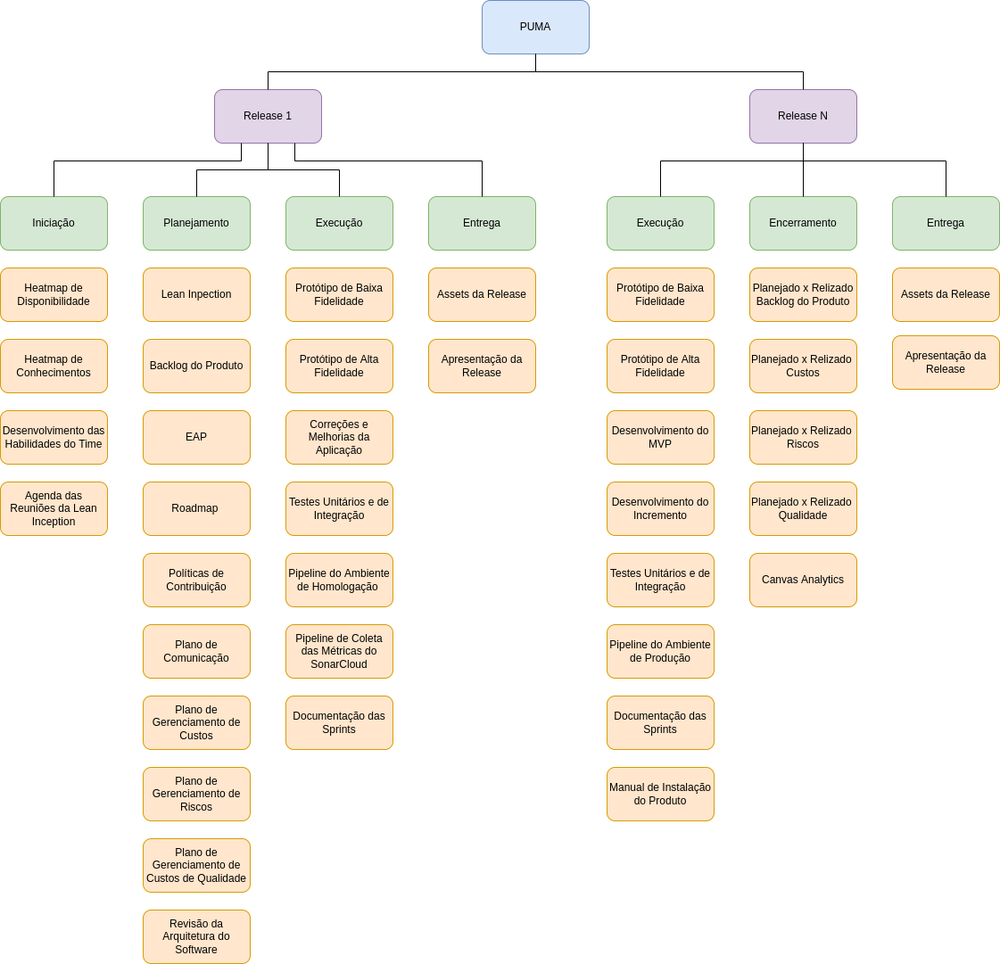

# Estrutura Analítica do Projeto

A Estrutura Analítica do Projeto(EAP) é uma decomposição hierárquica do escopo total do trabalho a ser executado pela equipe a fim de alcançar os objetivos do projeto e criar as entregas requeridas, em outras palavras, é a subdivisão das entregas em componentes menores e mais facilmente gerenciáveis.

Decomposição da EAP para o projeto PUMA:

- Primeiro Nível: nome do projeto.
- Segundo Nível: _releases_ do projeto. 
- Terceiro Nível: fases do projeto.
- Quarto Nível: pacotes de trabalho.

<!--  -->

<iframe frameborder="0" style="width:100%;height:750px;" src="https://viewer.diagrams.net/?tags=%7B%7D&highlight=0000ff&edit=_blank&layers=1&nav=1&title=EAP#Uhttps%3A%2F%2Fdrive.google.com%2Fuc%3Fid%3D1lP2BqxgWSD2VYFUQ13jZLM4OfzQeaII5%26export%3Ddownload"></iframe>

## Histórico de Versão

| Data       | Versão | Descrição            | Autores          |
| ---------- | ------ | -------------------- | ---------------- |
| 01/03/2022 | 1.0    | Criação do documento | Gustavo Nogueira |

## Referências

- Repositório MDS-EPS. EAP(Estrutura Analítica de Projeto) / WBS(Work Breakdown Structure). Disponível em: <https://github.com/fga-eps-mds/A-Disciplina-MDS-EPS/wiki/EAP>. Acesso em: 01 de março de 2022.
- PMBOK, GUIA. "Um guia do conjunto de conhecimentos em gerenciamento de projetos." Project Management Institute. 2004.