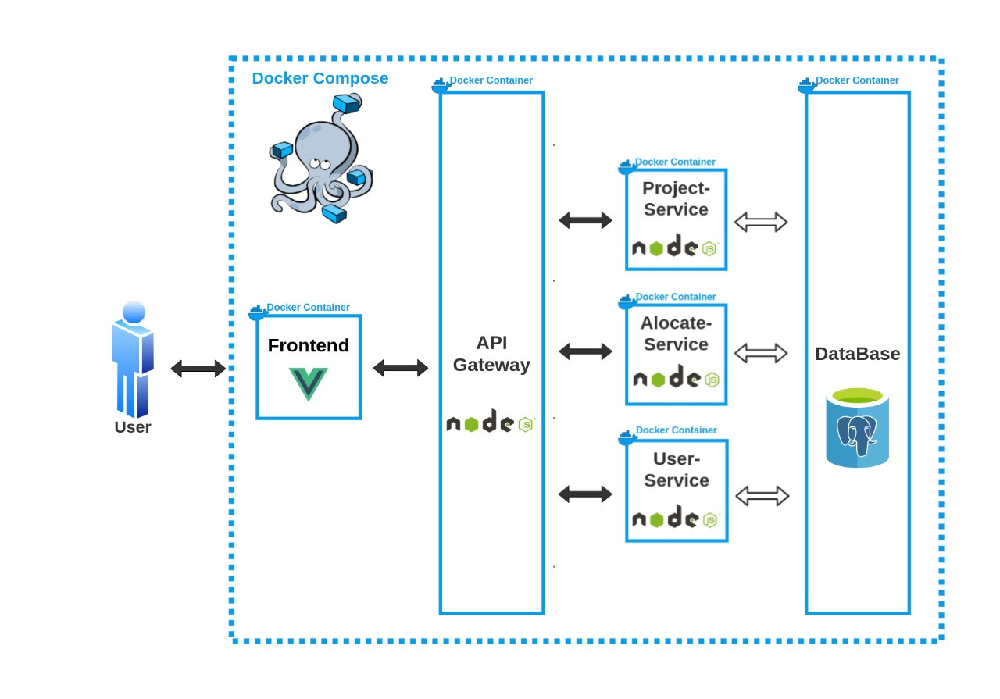
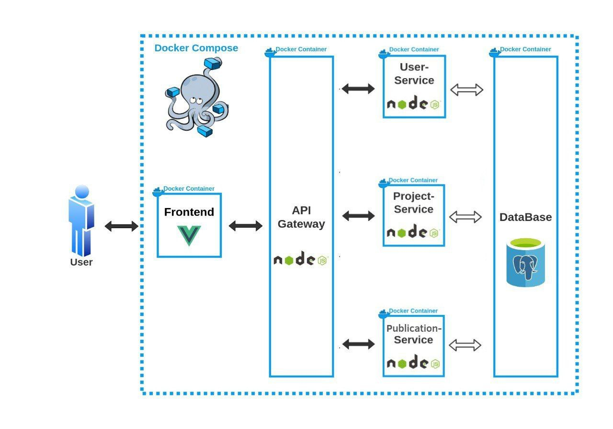

### Introdução
O documento de arquitetura possui por objetivo contextualizar a arquitetura de software aplicada no desenvolvimento do PUMA. 

## Objetivos
Possibilitar uma visão geral da arquitetura da plataforma e evidenciar seus aspectos. Sendo assim, esse documento busca transparecer as decisões arquiteturais que foram tomadas em relação ao PUMA.
Importante ressaltar que o projeto foi anteriormente arquitetado pelos membros da disciplina. A versão atual da arquitetura descrita nesse documento é uma contextualização e aperfeiçoamento da ideia trabalhada, considerando as novas especificações realizadas durante o processo da Lean Inception.

## Representação da Arquitetura
### Diagrama de relações
#### Versão Base

#### Versão Trabalhada

#### Versão Atual

#### 2.1 Representação dos Serviços
##### 2.1.1 Front End

    O front end é a interface onde o usuário irá se comunicar com o sistema. É composto por uma tela de cadastro e outra de registro, o que leva à página inicial do PUMA, a página de perfil de usuário. Nesse ponto, há a possibilidade de seguir diversos caminhos dentro do sistema, como as páginas de cadastro de proposta, avaliação de proposta e repositório de projetos.

##### 2.1.2 API Gateway

 O API Gateway é utilizado como um mutex para a comunicação entre a interface de usuário e os outros micro-serviços. Dessa forma, ao receber uma requisição o gateway atua como uma ponte entre o front end e o serviço desejado.

##### 2.1.3 Project-Service

    O serviço "Project-Service" foi planejado para lidar com todas as tarefas envolvendo projetos do sistema. Assim, o envio de propostas, o encaminhamento para o professor / disciplina adequada e as possíveis alterações nos projetos seriam todas tarefas para o Project-Service resolver.

##### 2.1.6 User-Service

    Desenvolvido para manter o controle de usuários, desde sua criação até o controle das rotas de acesso permitidas, criação de times dentre outros.

#### 2.2 Tecnologias
##### 2.2.1 Vue.js 

    É um framework Javascript open-source para criação de aplicações web, ele é muito utilizado para criação de aplicações SPA (Single Page Applications) e também pra vários outros tipos de interface, com foco na interação e experiência do usuário.

##### 2.2.2 Node.js

    É uma plataforma de aplicação para Javascript, que tem como principal objetivo facilitar a construção de softwares escaláveis. Ele geralmente é usado ao lado do servidor e é orientado para o estilo de programação voltada a evento. Isso faz com que ele seja leve, eficiente e uma boa alternativa para arquitetura de microsserviços.

##### 2.2.4 PostgreSQL 

    O PostgreSQL é um gerenciador de banco de dados relacionais que proporciona forte confiabilidade, robustez de recursos e desempenho.

##### 2.2.5 Docker

    Docker é uma plataforma, open-source para criação, execução e deploy de contêineres. Esses contêineres são pacotes da aplicação contendo suas dependências, bibliotecas e arquivos de configuração.

##### 2.2.6 Docker Compose

    Docker Compose é um orquestrador de contêineres Docker. Com ele é possível gerenciar vários contêineres de uma única vez, definindo o comportamento de cada um deles.

# Histórico de Revisão

| Data | Versão | Modificação | Autor |
| :-- | :-- | :-- | :-- |
| 16/03/2022 | 0.1 | Criação do documento e tópicos iniciais| Bruno Duarte |
