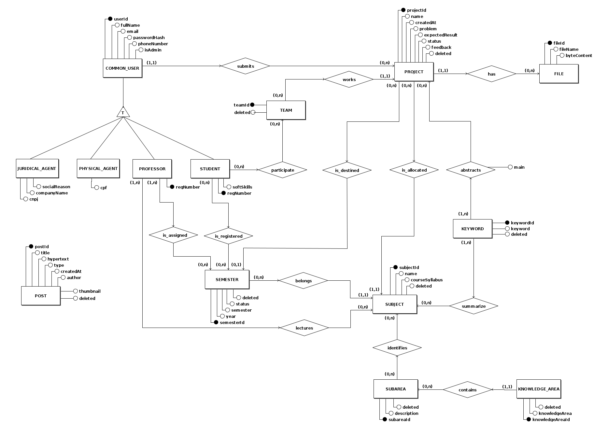
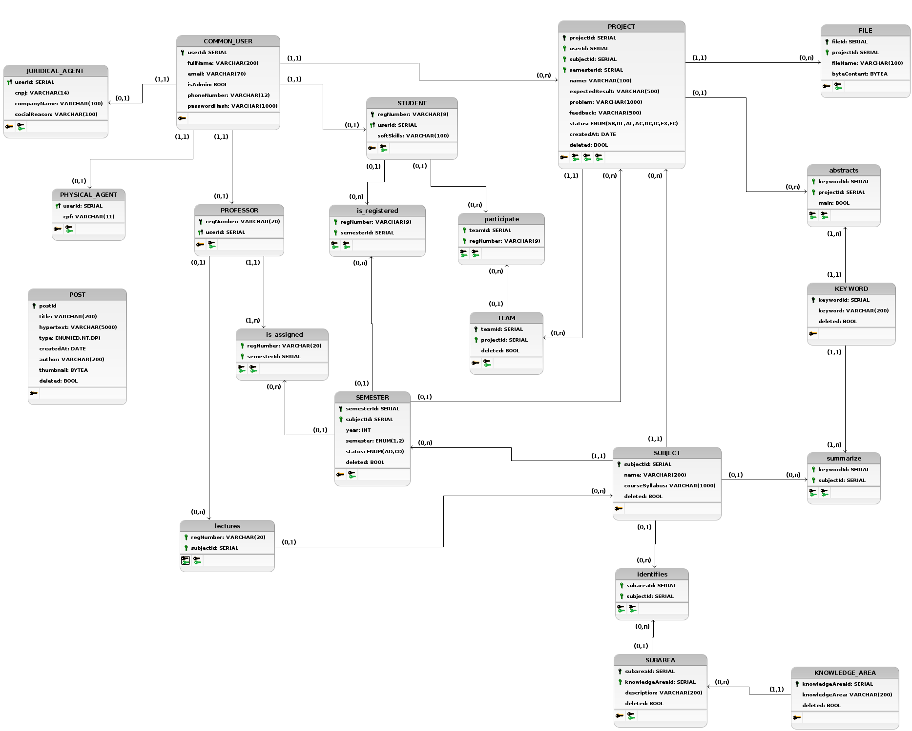

## Introdução

O documento de arquitetura possui por objetivo contextualizar a arquitetura de software aplicada no desenvolvimento do PUMA. 

## Objetivos

Possibilitar uma visão geral da arquitetura da plataforma e evidenciar seus aspectos. Sendo assim, esse documento busca transparecer as decisões arquiteturais que foram tomadas em relação ao PUMA.

Importante ressaltar que o projeto foi anteriormente arquitetado pelos membros da disciplina. A versão atual da arquitetura descrita nesse documento é uma contextualização e aperfeiçoamento da ideia trabalhada, considerando as novas especificações realizadas durante o processo da Lean Inception.

## Representação da Arquitetura

### Diagrama de Relações

#### Versão Base

#### Versão Revisada 

Versão considerando apenas o escopo do semestre

### Representação dos Serviços

#### Front End

 O front end é a interface onde o usuário irá se comunicar com o sistema. É composto por uma tela de cadastro e outra de registro, o que leva à página inicial do PUMA, a página de perfil de usuário. Nesse ponto, há a possibilidade de seguir diversos caminhos dentro do sistema, como as páginas de cadastro de proposta, avaliação de proposta e repositório de projetos.

#### API Gateway

 O API Gateway é utilizado como um mutex para a comunicação entre a interface de usuário e os outros micro-serviços. Dessa forma, ao receber uma requisição o gateway atua como uma ponte entre o front end e o serviço desejado.

#### Project-Service

    O serviço "Project-Service" foi planejado para lidar com todas as tarefas envolvendo projetos do sistema. Assim, o envio de propostas, o encaminhamento para o professor / disciplina adequada e as possíveis alterações nos projetos seriam todas tarefas para o Project-Service resolver.

#### User-Service

 Desenvolvido para manter o controle de usuários, desde sua criação até o controle das rotas de acesso permitidas, criação de times dentre outros. 

### Tecnologias

#### Vue.js 

    É um framework Javascript open-source para criação de aplicações web, ele é muito utilizado para criação de aplicações SPA (Single Page Applications) e também pra vários outros tipos de interface, com foco na interação e experiência do usuário.

#### Node.js

    É uma plataforma de aplicação para Javascript, que tem como principal objetivo facilitar a construção de softwares escaláveis. Ele geralmente é usado ao lado do servidor e é orientado para o estilo de programação voltada a evento. Isso faz com que ele seja leve, eficiente e uma boa alternativa para arquitetura de microsserviços.

#### PostgreSQL 

    O PostgreSQL é um gerenciador de banco de dados relacionais que proporciona forte confiabilidade, robustez de recursos e desempenho.

#### Docker

    Docker é uma plataforma, open-source para criação, execução e deploy de contêineres. Esses contêineres são pacotes da aplicação contendo suas dependências, bibliotecas e arquivos de configuração.

#### Docker Compose

    Docker Compose é um orquestrador de contêineres Docker. Com ele é possível gerenciar vários contêineres de uma única vez, definindo o comportamento de cada um deles.

## Banco de Dados

### Diagrama Entidade-Relacionamento

### Diagrama Lógico de Dados

### Legenda dos ENUMS

#### Status da Tabela PROJECT

| ENUM | Nome                                     | Descrição                                                                          |
| ---- | ---------------------------------------- | ---------------------------------------------------------------------------------- |
| SB   | Proposta Submetida (Pré-alocada)         | Utilizado quando a proposta é submetida.                                           |
| RL   | Proposta Realocada                       | Utilizado quando professor/administrador realoca a proposta para outra disciplina. |
| AL   | Proposta Aguardando Alocação      | Utilizado quando a proposta não possui disciplina alocada (a disciplina adequada para a proposta não é conhecida pelo professor responsável). |
| AC   | Proposta Aceita (Aguardando Semestre Disponível) | Utilizado quando a proposta for aceita por um professor/administrador, porém ainda não incluída a nenhum semestre.            |
| RC   | Proposta Recusada                        | Utilizado quando a proposta for recusada por um professor/administrador.           |
| IC   | Projeto em Iniciação (Formação de Times) | Utilizado quando a proposta for incluída para o semestre de alguma disciplina.     |
| EX   | Projeto em Execução                      | Utilizado quando o(s) time(s) designado(s) inicia(m) o desenvolvimento do projeto. |
| EC   | Projeto Encerrado                        | Utilizado quando o desenvolvimento do proejto for concluído.                       |

#### Status da Tabela SEMESTER

| ENUM | Nome         | Descrição                                |
| ---- | ------------ | ---------------------------------------- |
| AD   | Em Andamento | Para os semestres eu estão em andamento. |
| CD   | Concluído    | Para os semestres concluídos.            |

#### Type da Tabela POST

| ENUM | Nome                   | Descrição                           |
| ---- | ---------------------- | ----------------------------------- |
| ED   | Edital                 | Para publicação de editais.         |
| NT   | Notícia                | Para publicação de notícias.        |
| DP   | Divulgação de Projetos | Para divulgar os melhores projetos. |

# Histórico de Revisão

| Data       | Versão | Modificação                             | Autor                           |
| ---------- | ------ | --------------------------------------- | ------------------------------- |
| 16/03/2022 | 0.1    | Criação do documento e tópicos iniciais | Bruno Duarte                    |
| 16/03/2022 | 0.2    | Adição Tópico Banco de dados            | Bruno Duarte e Gustavo Nogueira |
| 16/03/2022 | 0.3    | Corrigindo referenciamento Imagens      | Bruno Duarte e Gustavo Nogueira |
| 25/03/2022 | 0.4    | Atulizando tópico banco de dados        | Bruno Duarte e Gustavo Nogueira |
| 10/04/2022 | 0.5    | Atulizando tópico banco de dados        | Bruno Duarte e Gustavo Nogueira |
| 12/04/2022 | 0.6    | Atulizando tópico banco de dados        | Bruno Duarte e Gustavo Nogueira |

