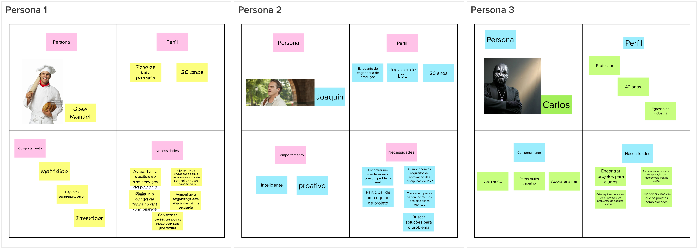
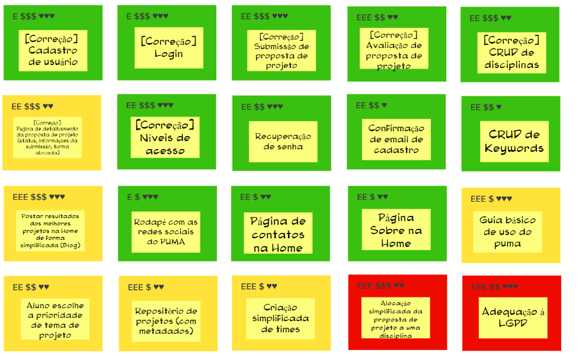

| Data       | Versão | Descrição            | Autores     |
| ---------- | ------ | -------------------- | ----------- |
| 15/03/2022 | 1.0    | Criação do documento | Time de EPS |

## Visão do Produto
Esta atividade auxilia a definir a visão do produto de modo colaborativo garantindo a conformidade das ações a serem tomadas e guiando a equipe de desenvolvimento.  

### Resultado

## O Produto É - Não é - Faz - Não Faz
Esta atividade busca determinar classificações acerca do produto, ajudando a identificar qual as limitações do mesmo, assim como quais aspectos iremos considerar na hora do desenvolvimento.  

### Resultado

## Objetivos do Produto
Esta atividade auxilia no levantamento e esclarecimento dos problemas que o produto propõe resolver permitindo o levantamento de objetivos do ponto de vista do negócio.  

### Resultado

## Personas
Esta atividade auxilia no entendimento a respeito dos usuários do produto,
descrevendo seus papéis e suas necessidades específicas para melhor descrição das funcionalidades do ponto de vista de quem interagirá com o produto final.  

### Resultado

## Jornada do Usuário
Esta atividade auxilia na compreensão a respeito das fases de interação dos diferentes usuários com o produto.  

### Resultado

## Brainstorming de Funcionalidades
Esta atividade é feita após termos evoluído no produto, lista de objetivos e personas anteriormente criadas.  
Desse forma, tem como propósito descobrir quais funcionalidades são necessárias para atender os objetivos discutidos anteriormente como também as necessidades dos usuários representados pelas personas.

### Resultado

## Revisão Técnica, de Negócio e de UX
Esta atividade busca detalhar, reavaliar e normalizar as diversas funcionalidades levantadas durante o brainstorming de funcionalidades, bem como descartar funcionalidades as quais não fazem sentido levar adiante.  

### Resultado

## Sequenciador
Esta atividade auxilia na organização e visualizãção das funcionalidades e da sequência de validação incremental do produto.  

### Resultado
 
 
 

## Canvas MVP
O Canvas MVP é um quadro visual que auxilia a equipe a alinhar e definir a estratégia do MVP.  

### Resultado

## Referências
CAROLI, Paulo. **Lean Inception**: How to Align People and Build the Right Product. 1 ed. São Paulo: Caroli, 2018.