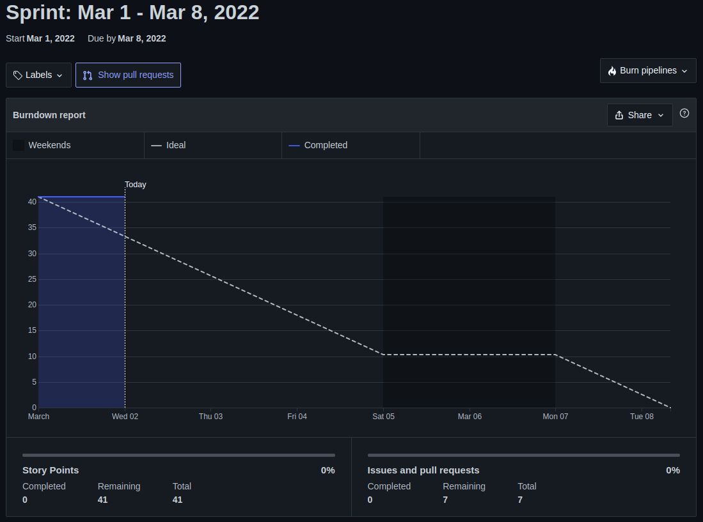
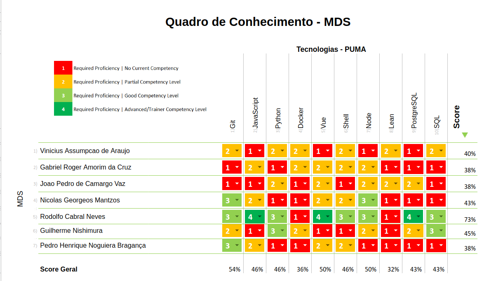

| Data | Versão | Autores | Descrição |
|--|--|--|--|
| 15/03/2022 | 1.0 | Eugênio Siqueira | Criação do documento |

# Resultados da Sprint 1
Reunião realizada em 11/03/2022

## Duração da Sprint
    Início: 12/03/2022
    Término: 15/03/2022

### Membros presentes
| Membro | Presente | Observação |
| ------ | -------- | ---------- |
| Bruno Henrique Sousa Duarte      | Sim |  |
| Eugênio Sales Siqueira           | Sim |  |
| Gabriel Roger Amorim da Cruz     | Sim |  |
| Guilherme Nishimura              | Sim |  |
| Gustavo Nogueira Rodrigues       | Sim |  |
| João Pedro de Camargo Vaz        | Sim |  |
| Luís Cláudio Telles Lima         | Sim |  |
| Nicolas Georgeos Mantzos         | Sim |  |
| Pedro Henrique Noguiera Bragança | Sim |  |
| Rodolfo Cabral Neves             | Sim |  |
| Vinicius Assumpção de Araujo     | Sim |  |

## Issues da sprint para o time de MDS

| Issue | Status |
| -- | -- |
| Adicionar campo telefone no formulário de cadastro.  | Entregue |
| Adicionar validação de campos no formuário de cadastro. Erros devem ser apresentados. | Entregue |
| Adicionar máscaras nos campos de CPF, CNPJ, Matrícula e CEP. | Entregue |
| Implementação de mecanismo de recuperação de senha. | Pendente |
| Mecanismo de acesso global aos dados do usuário que está logado na aplicação. Front-end(Vue + Vuex)  | Pendente |

## Issues para o time de EPS

| Issue | Status |
|--|--|
| Criar EAP do Projeto  | Entregue |
| Criar Agenda da Lean Inception | Entregue |
| Desenvolver tutorial de como rodar o projeto localmente | Entregue |
| Montar Heatmap de Conhecimentos | Entregue |
| Montar Heatmap de Disponibilidade | Entregue |
| Treinamento JavaScript | Entregue |
| Treinamento de Back-end | Entregue |
| Treinamento Front-end |  |
| Treinamento SQL | Entregue |
| Ambiente de Homologação | Entregue |
| Gerenciamento de custos | Entregue |
| Gerenciamento de riscos | Entregue |
| Backlog do produto | Entregue |
| Roadmap do Projeto | Entregue |
| Políticas de Contribuição | Entregue |
| Criar pipeline para extrair métricas do SonarCloud | Entregue
## Visão do time sobre a sprint
### Pontos Positivos
* Proatividade dos MDS
* Comunicação do time MDS
* Melhor adaptação dos membros de MDS

### Pontos negativos
* Curva de aprendizado de um projeto em um estágio de maturidade mais avançado
* Falta de organização das sprints anteriores

## Burndown

## Avaliação de Scrum Master

Os membros de MDS começaram a ter uma aximilação melhor do projeto e consequentemente, conseguiram realizar algumas entregas.

Em relação ao time de EPS, após realizado o alinhamento com os stakeholders, a tendência é que a organização seja mais fluida daqui em diante.

## Quadro de conhecimento depois da sprint 1

## Histórico de Versão

| Data       | Versão | Descrição            | Autores          |
| ---------- | ------ | -------------------- | ---------------- |
| 15/03/2022 | 1.0    | Criação do documento | Eugênio|